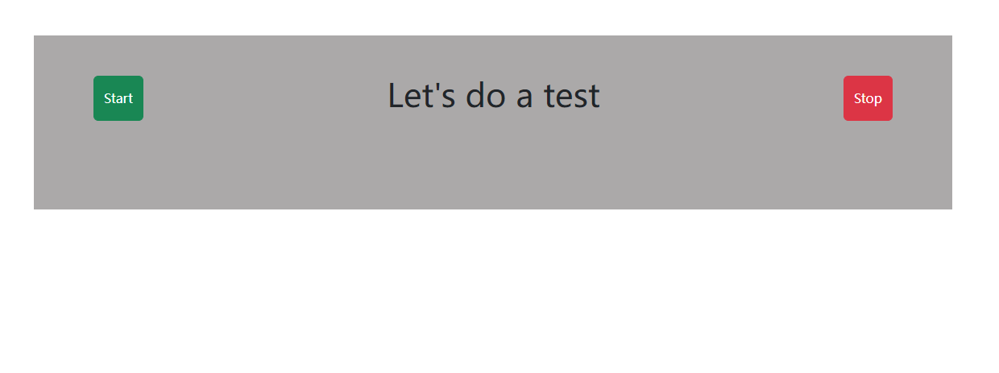
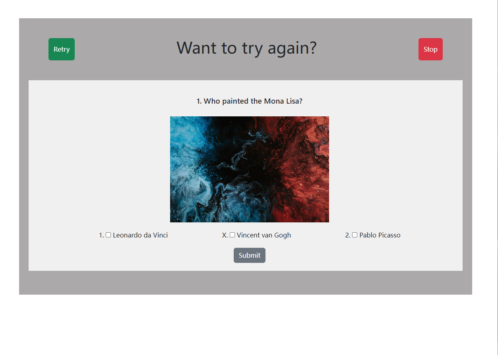

# DHA-Code-Test
This is a small Quiz Game. Backend is using Asp.Net Core Web API. Fronend is using Angular.

## About this app
- This is a small Quiz Game.
- User can start/retry and stop the quiz.
- There are 8 questions in the backend, 3 random questions will be present in the frontend.
- Each question only has one correct answer, when click Submit button, the result of this question verifys in backend and point will be calculated in fronend.
- After 3 questions, it will present how much point user earned.

## Running the app locally
❗ Make sure you have the latest version of the .NET sdk installed ❗
### Restore all the necessary NuGet dependencies:
`$ dotnet restore`

### Open backend folder in Visual Studio.
`$ dotnet run DHA-Code-Test-Backend.sln`

### Open frontend folder in Visual Studio Code.
`$ ng serve`

### Start Page
 

### Questions Page 
 

### Result Page 
 

